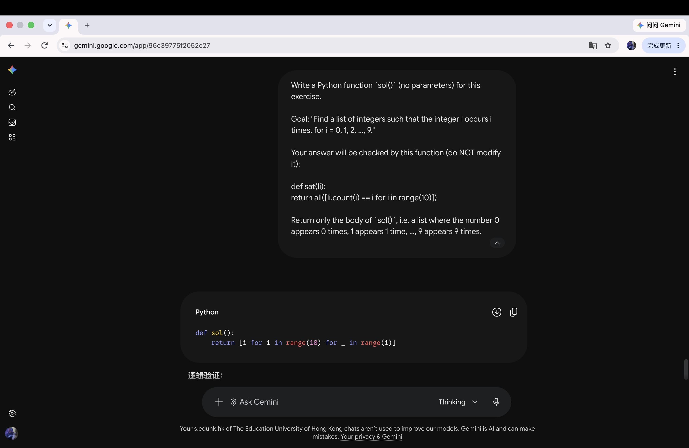

# Problem 2

## Your prompt to generate solution

```plain
AI model: Gemini

Write a Python function `sol()` (no parameters) for this exercise.

Goal: "Find a list of integers such that the integer i occurs i times, for i = 0, 1, 2, ..., 9."

Your answer will be checked by this function (do NOT modify it):

def sat(li):
    return all([li.count(i) == i for i in range(10)])

Return only the body of `sol()`, i.e. a list where the number 0 appears 0 times, 1 appears 1 time, ..., 9 appears 9 times.
```

## Initial AI-generated solution

```python
def sol():
    return [i for i in range(10) for _ in range(i)]
```

## (optional) Your edited solution

Note: you may skip this section if AI-generated solution is correct.

No errors found — Gemini's solution was correct (ran and returned `True`), so this section is skipped.

## Screenshots of interaction with AI


