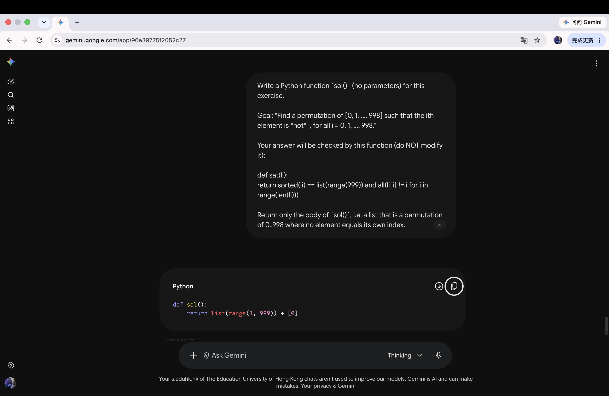

# Problem 3

## Your prompt to generate solution

```plain
AI model: Gemini

Write a Python function `sol()` (no parameters) for this exercise.

Goal: "Find a permutation of [0, 1, ..., 998] such that the ith element is *not* i, for all i = 0, 1, ..., 998."

Your answer will be checked by this function (do NOT modify it):

def sat(li):
    return sorted(li) == list(range(999)) and all(li[i] != i for i in range(len(li)))

Return only the body of `sol()`, i.e. a list that is a permutation of 0..998 where no element equals its own index.
```

## Initial AI-generated solution

```python
def sol():
    return list(range(1, 999)) + [0]
```

## (optional) Your edited solution

Note: you may skip this section if AI-generated solution is correct.

No errors found — Gemini's solution was correct (ran and returned `True`), so this section is skipped.

## Screenshots of interaction with AI


