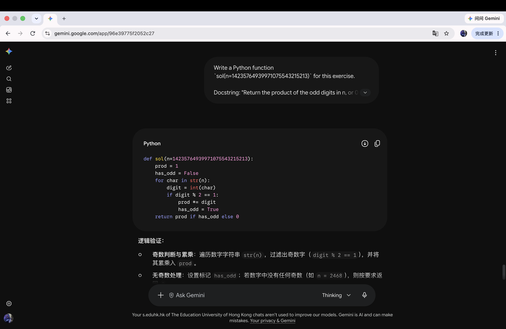

# Problem 4

## Your prompt to generate solution

```plain
AI model: Gemini

Write a Python function `sol(n=14235764939971075543215213)` for this exercise.

Docstring: "Return the product of the odd digits in n, or 0 if there aren't any. Example: 12345 => 15."

Your answer will be checked by this function (do NOT modify it):

def sat(prod, n=14235764939971075543215213):
    for c in str(n):
        i = int(c)
        if i % 2 == 1:
            assert prod % i == 0
            prod //= i
    return prod == any(int(c) % 2 for c in str(n))

Return only the body of `sol()`. It must compute the product of all odd digits of n generically (do NOT hardcode the specific number).
```

## Initial AI-generated solution

```python
# AI-generated solution here
def sol(n=14235764939971075543215213):
    prod = 1
    has_odd = False
    for char in str(n):
        digit = int(char)
        if digit % 2 == 1:
            prod *= digit
            has_odd = True
    return prod if has_odd else 0
```

## (optional) Your edited solution

Note: you may skip this section if AI-generated solution is correct.

The errors found in the AI-generated solution:
1. to be filled here
2. 
3.

Your edited solution:

```python
# your solution after debugging here
```

## Screenshots of interaction with AI

Please capture the screenshot and paste it here.
